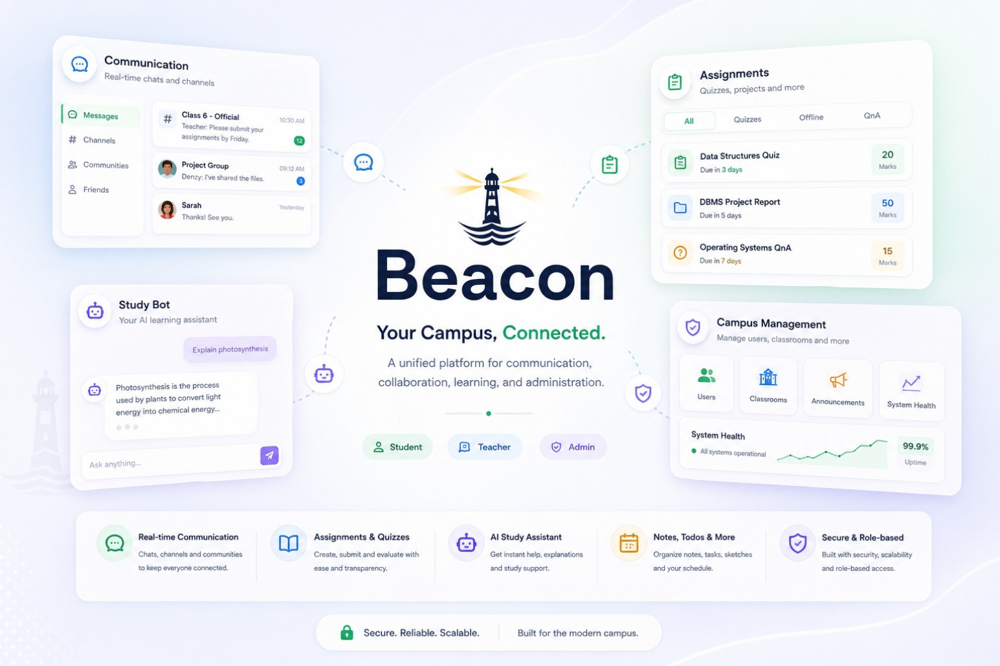

<div align="center">



# Beacon


**Live Demo:** [beacon-app.onrender.com](https://streak-app-wrog.onrender.com)

| Role | Registration No. | Password |
| :---: | :---: | :---: |
| Student 1 | `232STUD01` | `pass123` |
| Student 2 | `232STUD02` | `pass123` |
| Teacher | `232TEACH01` | `pass123` |

</div>

---

## What This Project Is

Academic communication in colleges runs on WhatsApp groups - announcements get buried, assignments get missed, and there is no separation between official and casual conversation. **Beacon fixes that.**

It is a full-stack, role-based campus collaboration platform where every piece of communication has a defined place. Teachers post to official channels. Students collaborate in their own hubs. Nothing important ever gets lost in a chat scroll.

### What Each Role Can Do

| Feature | Student | Teacher | Admin |
| :--- | :---: | :---: | :---: |
| Real-time messaging (DMs, group chats) | Yes | Yes | - |
| Classroom official channel | Read | Post / Announce | - |
| Student hub (peer collaboration) | Yes | - | - |
| Assignments - submit / grade | Submit | Publish & Grade | - |
| Quizzes with cheat detection | Take | Create | - |
| AI study / research assistant | Yes | Yes | - |
| Notes, Todos, Sketch board | Yes | Yes | - |
| University-wide announcements | Read | Read | Post |
| User & classroom management | - | - | Yes |
| Server logs & live metrics | - | - | Yes |

## Current Implementation Status

Fully implemented in current branch:
- Auth + role routing (student/teacher/admin).
- Home and community experiences for student/teacher.
- Admin dashboard, user management, classroom management, bulk user import, server logs, university announcements.
- Backend APIs for all major modules listed above.
- Calendar image update API (`PUT /api/calendar/image-paths`) with admin guard and Cloudinary upload.

Partially implemented / placeholder in current branch:
- `Admin > Transfer User` page exists but is currently a placeholder UI.
- `Admin > Calendar` page exists but is currently a placeholder UI.
- Legacy docs helper (`client/src/services/doc.service.js`) returns empty arrays and is not wired into main routing.

## Architecture

## Frontend (`client/`)
- Stack: React 18, Vite, React Router, Tailwind CSS.
- Auth context combines Firebase Auth state + Mongo profile (`/api/me`).
- Route protection is role-based (`student`, `teacher`, `admin`).
- Real-time updates use `socket.io-client`.
- API calls use mixed patterns: centralized `apiClient` (token interceptor) and direct `fetch/axios` with Firebase token.
- Home data is centralized in `HomeDataContext` (todos, notes, calendar, notifications, announcements).
- Session prefetch + in-session page cache reduce redundant fetches.

Main route structure:
- `/` - Login and onboarding gates.
- `/student/*` - Home + Community + Profile + Quiz session route.
- `/teacher/*` - Home + Community + Profile.
- `/admin/*` - Dashboard + management/ops pages.

## Backend (`server/`)
- Stack: Express 5, Mongoose, Firebase Admin, Socket.IO.
- Security middleware: Helmet, CORS allowlist, API rate limit on `/api`.
- Auth middleware verifies Firebase ID token on protected routes.
- Central error middleware handles not-found and runtime errors.
- Metrics sampler records request/runtime stats for admin dashboard.
- Session caching helper stores per-user page cache in `sessionStorage`.

## Core Domain Modules (As Implemented)

## Authentication and Identity
- Firebase login from client (email/password + Google popup path).
- Backend profile lookup and profile sync endpoint:
  - `POST /api/login-lookup`
  - `GET /api/me`
  - `POST /api/logout`
  - `PUT /api/update-profile`
  - `PUT /api/sync-email`
- Onboarding gates in UI require password reset + verified email before normal app access.

## Chat and Realtime Communication
- Channel types: `dm`, `project_group`, `community`, `classroom`.
- Student DMs are friendship-gated and same-role only.
- Teacher-student direct DMs are not normal DM channels; teacher assignment interactions are surfaced through classroom/assignment flows.
- Group chat supports participant add/remove, admin transfer, deadline logic, and auto-message lock after deadline.
- Read status and unread counting supported.
- Socket features include:
  - Room join/leave.
  - Live message delivery.
  - Typing indicators.
  - Seen receipts.
  - Online user presence updates.
  - Event pushes for friend and notification updates.

## Classroom and Community
- Classroom model supports:
  - Metadata (`course`, `semester`, `shift`).
  - `officialChannelId` and `unofficialChannelId`.
  - Subject list with teacher assignment and file uploads.
- Official announcements support threaded comments/doubt-style replies.
- Classroom description is editable.

## Assignments and Quiz Flow
- Assignment types: `offline`, `quiz`, `qna`.
- Teacher/admin can publish to classroom if authorized.
- Publishing creates assignment message in official channel and pushes student notifications.
- Student submissions:
  - Offline/file submission (single submission enforced once submitted).
  - Quiz start tracking (`attempts`) and quiz submit scoring.
  - Cheat flag endpoint for quiz sessions.
- Teacher-side views:
  - Class assignment list.
  - Per-assignment submissions with score/feedback updates.
  - Doubts feed with private or broadcast replies.

## Notes, Todos, Sketch
- Todos: CRUD + max 30 tasks per user.
- Notes: CRUD with title/content/color/pinned/category/watermark fields.
- Sketch: one persistent whiteboard document per user, with payload-size guard.
- Notes sharing supports friends/peers, groups, and classroom channels (student hub + official teacher channels).

## Bot (AI Chat)
- Endpoint set:
  - `POST /api/bot/chat`
  - `GET /api/bot/history`
  - `GET /api/bot/session/:id`
  - `DELETE /api/bot/session/:id`
  - `PATCH /api/bot/session/:id/title`
- Uses Gemini (`gemini-2.5-flash`) through `@google/generative-ai`.
- Sessions store rolling summary + messages, include size guard, and TTL cleanup for unsaved sessions.

## Uploads and File Handling
- Upload API:
  - `POST /api/uploads/chat-attachment`
  - `GET /api/uploads/file/:encodedPath`
- Storage target is Cloudinary.
- Allowed file types include PDF, Office docs, and common images.
- Server-side size limit defaults to 2 MB (`MAX_ATTACHMENT_SIZE_BYTES`).
- Office files can generate PDF preview when LibreOffice runtime is available.
- Safe path prefix checks are enforced on download.

## Calendar and Timetable
- Calendar endpoint returns academic year, events, and semester image URL candidates:
  - `GET /api/calendar/current`
  - `GET /api/calendar/image/:semester`
- Calendar update endpoint for admins:
  - `PUT /api/calendar/image-paths`
- Timetable endpoint:
  - `GET /api/timetable/weekly?course=&semester=&shift=` (student)
  - `GET /api/timetable/weekly?department=&shift=` (teacher)

## Notifications and Friends
- Notifications: fetch, mark read (single or scoped), clear-all, delete-one.
- Friend system is student-only for friend request/accept/decline/remove.
- Friend events can trigger real-time updates through sockets.

## University Announcements
- Read recent university-wide announcements (authenticated users).
- Create announcements restricted to admin role.
- Supports message-only and message/file combinations.
- Emits live socket event `university_announcement_new` used by home widgets.

## Admin Module (Implemented)
- User management:
  - List users.
  - Create single user.
  - Enable/disable user.
  - Update user.
  - Delete user.
- Bulk upload:
  - CSV import flow in UI, sequentially calls create-user API.
- Classroom management:
  - Create one classroom.
  - Bulk create per course (semesters/shifts).
  - Add subjects.
  - Assign teachers to subjects.
  - Delete classroom or full course network.
- Dashboard:
  - Live metrics snapshots and timeline points (requests, memory, DB counts, storage usage estimations).
- Logs:
  - Paginated/filterable server activity logs.

## Data Layer (MongoDB Models)

Main models present in this branch:
- `User`
- `Classroom`
- `Channel`
- `Message`
- `Assignment`
- `Submission`
- `Doubt`
- `Announcement`
- `Comment`
- `Todo`
- `Note`
- `Sketch`
- `BotSession`
- `AcademicCalendar`
- `TimeTable`
- `UniversityAnnouncement`
- `Log`

## Environment Configuration

## Server (`server/.env` based on `.env.example`)
- `MONGO_URI`
- `GOOGLE_API_KEY`
- `CLOUDINARY_CLOUD_NAME`
- `CLOUDINARY_API_KEY`
- `CLOUDINARY_API_SECRET`
- `LIBREOFFICE_PATH`
- Firebase Admin credential fields:
  - `FIREBASE_PROJECT_ID`
  - `FIREBASE_PRIVATE_KEY_ID`
  - `FIREBASE_PRIVATE_KEY`
  - `FIREBASE_CLIENT_EMAIL`
  - `FIREBASE_CLIENT_ID`
  - `FIREBASE_AUTH_URI`
  - `FIREBASE_TOKEN_URI`
  - `FIREBASE_AUTH_PROVIDER_X509_CERT_URL`
  - `FIREBASE_CLIENT_X509_CERT_URL`
- `FIREBASE_UNIVERSE_DOMAIN`
- Calendar IDs:
  - `CALENDAR_ODD_PUBLIC_ID`
  - `CALENDAR_EVEN_PUBLIC_ID`
- Other server settings:
  - `CLIENT_URL` (comma-separated allowlist)
  - `TRUST_PROXY`
  - `PORT`

## Client (`client/.env` based on `.env.example`)
- `VITE_API_BASE_URL`
- `VITE_GIPHY_API_KEY`
- Firebase client keys:
  - `VITE_FIREBASE_API_KEY`
  - `VITE_FIREBASE_AUTH_DOMAIN`
  - `VITE_FIREBASE_PROJECT_ID`
  - `VITE_FIREBASE_STORAGE_BUCKET`
  - `VITE_FIREBASE_MESSAGING_SENDER_ID`
  - `VITE_FIREBASE_APP_ID`

## Local Development

From root, run both apps separately.

Server:
```bash
cd server
npm install
npm run dev
```

Client:
```bash
cd client
npm install
npm run dev
```

Expected defaults:
- Backend: `http://localhost:5000`
- Frontend: `http://localhost:5173`

## Request Optimization Notes (Current Branch)
- `sessionPrefetch` warms `/me`, `/chat/my-channels`, `/notifications`, then batches home data.
- `getOrFetchPageCache` provides per-user, per-page session cache with TTL.
- HomeDataContext guards prevent repeated fetch loops across notes/todos/calendar/notifications.
- Calendar image fetch is guarded to prevent duplicate blob requests.

## Important Behavior Constraints (Current Branch)
- CORS allows localhost frontend and optional `CLIENT_URL` env.
- API rate limits:
  - Strict (public/abuse-prone): 100 per 15 minutes.
  - Relaxed (most `/api` routes): 2000 per 15 minutes.
- Todos are capped at 30 per user.
- Sketch save payload is rejected if too large.
- Uploads require allowed MIME and size rules.
- Some admin pages are intentionally UI placeholders (see status section).

## 🤝 Team & Contributors

Beacon was developed by:
* **[Charan R](https://github.com/charancreates)**
* **Denzil Deepak**
* **Sahil**
* **Duke**